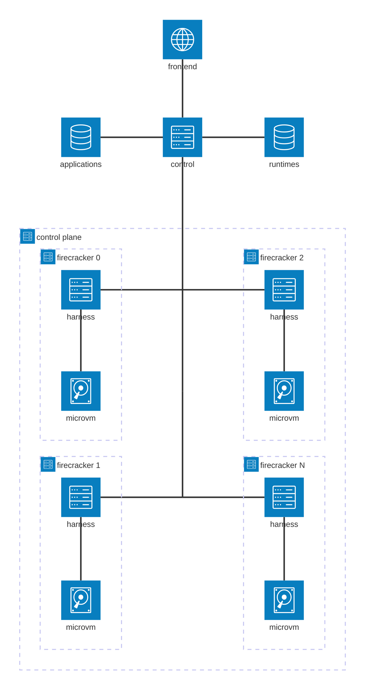

# InvokeX
Welcome to InvokeX - a simple implementation of serverless infrastructure.

## Project scope
This project is meant to be an educational project to learn how AWS's serverless infrastructure works.
InvokeX is built upon the [same microvm technology](https://github.com/firecracker-microvm/firecracker) as [AWS Lambda](https://docs.aws.amazon.com/lambda/).

While you are more than welcome to try and run production workloads on InvokeX, there are absolutely no guarantees whatsoever regarding stability, support, and reliability.

## Architecture
At its core, InvokeX is a harness over Firecracker.
However, InvokeX is a bit more than just a hypervisor for Firecracker VMs.
InvokeX is a modular system that allows developers to upload their applications to InvokeX and it will magically run as a serverless workload.

